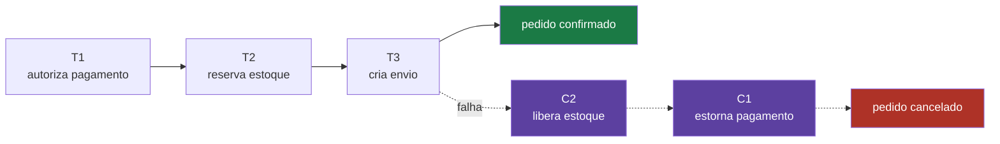

# 01 — Por que SAGA

## O problema

Confirmar um pedido exige quatro coisas que vivem em bancos diferentes: debitar o
cartão, reservar o estoque, criar o envio, avisar o cliente. Num monolito com um banco
só, isso é uma transação:

```sql
BEGIN;
  INSERT INTO pedidos ...;
  UPDATE cartoes SET saldo = saldo - 9980 ...;
  UPDATE estoque SET qtd = qtd - 1 ...;
  INSERT INTO envios ...;
COMMIT;
```

Atômico, consistente, isolado, durável. Se qualquer passo falhar, nada aconteceu.

Ao dividir em cinco serviços com **um banco cada** ([ADR-0005](../adr/0005-banco-por-servico.md)),
essa transação deixa de existir. Não há `BEGIN` que abranja cinco Postgres.

E não, não dá para trazer de volta:

- **Two-phase commit (XA)** exige que todos os participantes suportem prepare/commit
  coordenado. Kafka não participa de XA. HTTP não participa de XA. O gateway de
  pagamento do seu parceiro definitivamente não participa de XA.
- **Locks distribuídos** transformam disponibilidade em refém: se o serviço de estoque
  cai segurando um lock, os pedidos param.

## O mecanismo

A SAGA troca uma transação atômica por **uma sequência de transações locais**, cada uma
com sua **compensação**. Se o passo 3 falha, você não faz rollback — você executa as
ações que _desfazem_ os passos 1 e 2.



O que você ganha: disponibilidade e independência entre serviços.

O que você perde, e é preciso dizer com clareza:

| Propriedade  | Transação ACID       | SAGA                                                  |
| ------------ | -------------------- | ----------------------------------------------------- |
| Atomicidade  | garantida pelo banco | **simulada** por compensação                          |
| Consistência | imediata             | **eventual**                                          |
| Isolamento   | garantido            | **inexistente** — estados intermediários são visíveis |
| Durabilidade | garantida            | garantida (cada passo commita local)                  |

A perda de **isolamento** é a que mais surpreende. Durante a saga, o pagamento já está
autorizado e o estoque já está reservado, e qualquer um que consulte vê isso. Se a saga
falhar depois, esses estados existiram e foram observáveis. Não há como esconder.

Consequência prática: **compensação não é rollback**. Estornar um pagamento não apaga a
cobrança — deixa duas linhas no extrato do cliente. Liberar uma reserva não desfaz o
fato de o item ter ficado indisponível para outro comprador por 40 segundos. O desenho
tem que assumir isso, não fingir o contrário.

## No código

- Estados e transições: [`packages/contracts/src/common.ts`](../../packages/contracts/src/common.ts) — `ORDER_STATUS`, `isTerminal`
- A matriz de compensação como dado: [`packages/contracts/src/registry.ts`](../../packages/contracts/src/registry.ts) — `COMPENSATION_MATRIX`

## O que quebra se você errar

Tentar preservar isolamento com locks distribuídos entre serviços. Funciona no teste com
um pedido e derruba a produção na primeira contenção: o serviço que segura o lock cai, e
todos os outros ficam esperando um lock que nunca será liberado.

## Leia também

- [ADR-0002 — SAGA coreografada](../adr/0002-saga-coreografada.md)
- [ADR-0005 — Um banco por serviço](../adr/0005-banco-por-servico.md)
- Próximo: [02 — Coreografia vs. orquestração](02-coreografia-vs-orquestracao.md)
