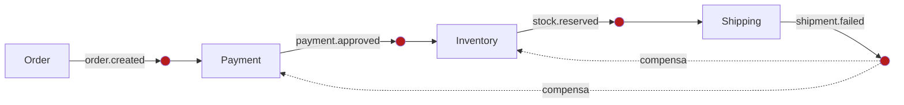
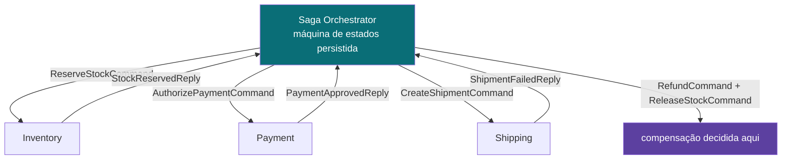

# 02 — Coreografia vs. orquestração

## O problema

A SAGA precisa de alguém decidindo o que vem depois. Há duas respostas, e elas produzem
sistemas muito diferentes.

## O mecanismo

**Coreografia** — ninguém coordena. Cada serviço assina os tópicos que lhe interessam,
reage, e publica o que aconteceu no seu domínio.



**Orquestração** — um coordenador central mantém a máquina de estados, envia comandos e
trata as falhas num lugar só.



## O trade-off, sem torcida

|                                                     | Coreografia                              | Orquestração                  |
| --------------------------------------------------- | ---------------------------------------- | ----------------------------- |
| Quem conhece o fluxo                                | ninguém                                  | o orquestrador                |
| Adicionar consumidor passivo (relatório, auditoria) | nada muda                                | nada muda                     |
| Adicionar uma **etapa** na saga                     | mexe em **todos** os serviços anteriores | mexe no orquestrador          |
| "Por que o pedido X foi cancelado?"                 | juntar log de 4 serviços                 | uma consulta                  |
| Ponto único de falha lógica                         | não existe                               | o orquestrador                |
| Acoplamento                                         | implícito, espalhado                     | explícito, centralizado       |
| Latência                                            | menor (sem hop de coordenação)           | maior (ida e volta por passo) |

Este projeto escolheu **coreografia** de propósito, para você sentir o custo. Olhe a
tabela de assinaturas:

```ts
// packages/contracts/src/topics.ts
[CONSUMER_GROUPS.payment]: [TOPICS.orders, TOPICS.inventory, TOPICS.shipping],
```

O Payment Service assina `inventory` e `shipping` — **domínios que não são dele**. Por
quê? Porque para estornar ele precisa saber que o estoque faltou ou que o envio falhou.
Em coreografia, cada serviço precisa conhecer as falhas de todos os passos posteriores.

Acrescente uma 5ª etapa (digamos, emissão de nota fiscal) e você mexe em Payment,
Inventory **e** Shipping, para todos passarem a assinar o novo tópico de falha. É isso
que "acoplamento implícito" significa na prática — implícito porque não aparece em
nenhum import, só na tabela de assinaturas e no conhecimento espalhado.

## A ironia que vale registrar

Coreografia não tem quem vigie o todo. Um `stock.reserved` que nunca vira
`shipment.created` deixa o pedido pendurado para sempre — nenhum serviço sabe que era a
vez do Shipping, porque nenhum serviço sabe que existe uma sequência.

A solução é um **sweeper de timeout** no Order Service, varrendo pedidos parados e
disparando compensação. Ou seja: para a coreografia funcionar de verdade, o Order Service
acabou virando um meio-orquestrador.

Esse é o argumento mais honesto a favor da orquestração, e está aqui de propósito.

## No código

- Assinaturas e o acoplamento: [`packages/contracts/src/topics.ts`](../../packages/contracts/src/topics.ts) — `SUBSCRIPTIONS`
- Teste que documenta o acoplamento: [`packages/contracts/test/topics.spec.ts`](../../packages/contracts/test/topics.spec.ts) — `describe('acoplamento implícito da coreografia')`

## Veja

Abra o [simulador](../simulator/saga-console.html) e olhe a topologia: as linhas saindo
do barramento `ecommerce.shipping.v1` para **três** consumer groups diferentes são o
acoplamento desenhado.

## O que quebra se você errar

Um serviço publicando no tópico que ele mesmo assina. Em coreografia não há coordenador
para notar o laço: o serviço se realimenta infinitamente, e você descobre pela fatura do
broker. Há um teste que impede isso.

## Leia também

- [ADR-0002 — SAGA coreografada](../adr/0002-saga-coreografada.md)
- Próximo: [03 — Partições, chave e ordenação](03-particoes-chave-e-ordenacao.md)
