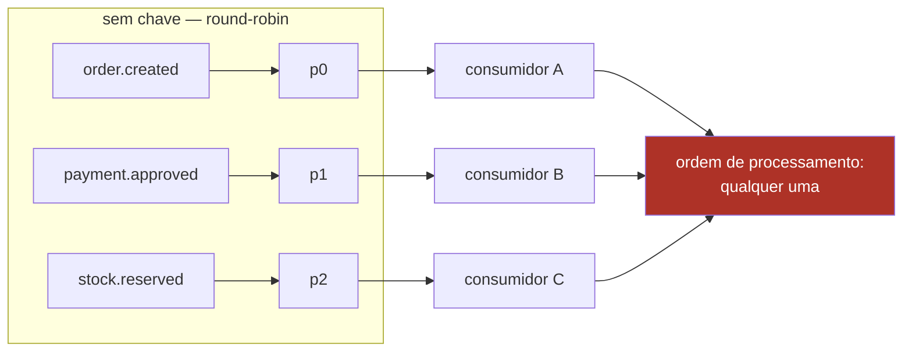
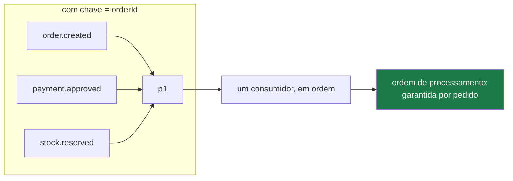

# 03 — Partições, chave e ordenação

## O problema

`payment.approved` e `payment.refunded` do mesmo pedido chegam ao Order Service na ordem
errada: o estorno é processado antes da aprovação. A projeção fica inconsistente e não há
nada no log indicando erro.

## O mecanismo

Kafka garante ordem **dentro de uma partição**, nunca entre partições. Partições
diferentes são consumidas em paralelo, por membros possivelmente diferentes do grupo.

Sem chave, o produtor distribui em round-robin:



Com `key = orderId`, o produtor usa `hash(chave) % nº de partições`. Todos os eventos do
pedido caem na mesma partição, logo são ordenados entre si:



E o paralelismo **não** é sacrificado: pedidos diferentes continuam espalhados por todas
as partições. Você ordenou por agregado, não serializou o tópico.

## Rode

```bash
pnpm ex 01
```

Ele publica os mesmos 16 eventos em dois tópicos — um sem chave, um com — e conta em
quantas partições distintas os eventos de cada pedido caíram. Sem chave: 3 partições por
pedido. Com chave: 1.

## Os três limites

**1. A garantia vale por tópico.** O Order Service consome `payments`, `inventory` e
`shipping`. Mesmo com a chave certa em todos, ele pode ver `stock.reserved` antes de
`payment.approved`, porque são partições de tópicos diferentes. Nenhuma chave resolve
isso — a defesa é a máquina de estados monotônica, que rejeita transição inválida em vez
de corromper o agregado.

**2. Mudar o número de partições reembaralha o mapeamento.** `hash(chave) % 3` e
`hash(chave) % 6` dão respostas diferentes. Eventos antigos de um pedido ficam numa
partição e os novos em outra: a ordenação dos pedidos **em voo** quebra. Repartitionar é
operação planejada, com o fluxo drenado — não ajuste de capacidade.

**3. Hot partition.** Se um agregado concentra tráfego, ele concentra numa partição só.
Irrelevante aqui (poucos eventos por pedido); sério num domínio com agregado "quente".
Rode o exemplo 01 e olhe a distribuição: dois dos quatro pedidos caíram em `p1`.

## No código

```ts
// packages/contracts/src/envelope.ts
aggregateId: z.string().min(1),
// Sempre o orderId: é também a chave da partição Kafka, o que garante
// ordenação por pedido.
```

- Envelope: [`packages/contracts/src/envelope.ts`](../../packages/contracts/src/envelope.ts)
- Partições por tipo de tópico: [`deploy/docker/scripts/create-topics.mjs`](../../deploy/docker/scripts/create-topics.mjs) — `specFor()`

## O que quebra se você errar

Publicar sem chave "porque o volume é baixo". Funciona até o dia em que dois eventos do
mesmo pedido são produzidos com poucos milissegundos de diferença e caem em partições
diferentes. A falha é rara, não reproduzível sob demanda, e corrompe estado.

## Leia também

- [ADR-0009 — `orderId` como chave de partição](../adr/0009-orderid-como-chave-de-particao.md)
- Próximo: [04 — Entrega e commit de offset](04-entrega-e-commit-de-offset.md)
