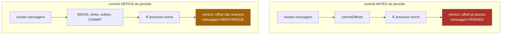

# 04 — Entrega e commit de offset

## O problema

O consumidor faz duas coisas: aplica o efeito no banco e avança o offset. A ordem entre
as duas decide qual falha você vai ter quando o processo morrer no meio — e uma das duas
falhas é irreversível.

## O mecanismo

Um offset commitado é uma promessa: _"tudo até aqui, eu já resolvi"_. Fazer essa promessa
antes de ela ser verdade perde a mensagem.



Perda é irreversível: nenhum retry traz de volta uma mensagem cujo offset já passou.
Duplicata é tratável — e o módulo [06](06-idempotencia.md) mostra como.

Por isso o esqueleto de **todo** handler do sistema é sempre este:

```
BEGIN
  INSERT processed_messages   ← "já vi este evento"
  <efeito de negócio>
  INSERT outbox               ← o próximo evento da saga
COMMIT
commitOffsets()               ← e só agora
```

## Rode

```bash
pnpm ex 02
```

Seis mensagens, um crash na terceira, dois consumer groups com as ordens opostas. A saída
mostra a tabela do banco:

```
 mensagem │ CASO A (commit antes) │ CASO B (commit depois)
──────────┼───────────────────────┼────────────────────────
  m2      │ — PERDIDA             │ 2 ← DUPLICADA
```

## Por que `autoCommit: false`

Com `autoCommit: true`, o kafkajs avança o offset num timer próprio — a cada 5 segundos
por padrão — sem a menor ideia de se o seu `COMMIT` de banco aconteceu. Você perde o
controle exatamente sobre a decisão que este módulo inteiro discute.

É também o motivo de [ADR-0004](../adr/0004-kafkajs-em-vez-de-nestjs-microservices.md):
o transport Kafka do `@nestjs/microservices` gerencia o offset por conta própria, e
contorná-lo dá mais trabalho que não usá-lo.

```ts
// examples/src/_shared/kafka.ts
const c = kafka.consumer({ groupId, sessionTimeout: 10_000, heartbeatInterval: 3_000 });
// ...
await c.run({ autoCommit: false, eachMessage: async ({ message, partition }) => { ... } });
```

## O detalhe que morde no deploy

Graceful shutdown. Ao receber `SIGTERM`, o consumidor tem que: parar de buscar novas
mensagens → terminar o que está em voo → commitar → fechar. Nessa ordem.

Sem isso, **todo** rolling update reproduz o caso B: mensagens em processamento morrem
antes do commit e voltam duplicadas. Em Kubernetes isso vira
`terminationGracePeriodSeconds: 45` mais um `preStop`, casados com o shutdown da
aplicação.

## O que quebra se você errar

Commitar dentro de um `finally`. Parece defensivo — "garantir que o offset avança" — e é
exatamente o caso A: o offset avança inclusive quando o handler lançou exceção. Você
transformou todo erro em perda silenciosa.

## Leia também

- [ADR-0004 — kafkajs em vez do transport do NestJS](../adr/0004-kafkajs-em-vez-de-nestjs-microservices.md)
- [ADR-0007 — Idempotência por inbox](../adr/0007-idempotencia-por-inbox.md)
- Próximo: [05 — Transactional Outbox](05-outbox.md)
