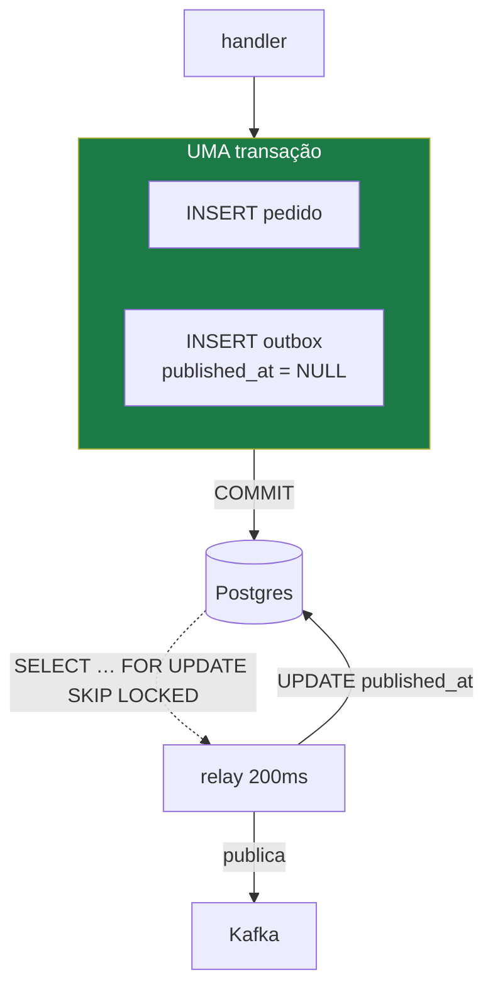

# 05 — Transactional Outbox

## O problema

Criar um pedido significa gravar no Postgres **e** publicar `order.created` no Kafka. São
dois sistemas sem transação comum, e as duas ordens possíveis falham:

- **persistir → publicar**: o processo morre no meio. Pedido existe, evento não. A saga
  nunca começa; ninguém percebe até o cliente ligar.
- **publicar → persistir**: o `COMMIT` falha. Evento existe, pedido não. O Payment
  autoriza a cobrança de um pedido inexistente. Pior das duas.

## O mecanismo

Grave a **intenção de publicar** na mesma transação do efeito. Um relay assíncrono lê as
intenções pendentes e publica.



Depois do `COMMIT`, ou os dois existem, ou nenhum. Publicar passa a ser um segundo
problema — resolvível, porque a intenção sobreviveu.

## O papel do `SKIP LOCKED`

Com duas ou mais réplicas do relay, um `SELECT` comum faz todas lerem as mesmas linhas
pendentes e publicarem cada evento N vezes. `FOR UPDATE SKIP LOCKED` trava a linha no
momento em que ela é **escolhida**, e as outras réplicas simplesmente pulam para as
próximas.

```sql
SELECT id, event_id, event_type, payload
  FROM outbox
 WHERE published_at IS NULL
 ORDER BY id
 LIMIT 100
 FOR UPDATE SKIP LOCKED;
```

E o índice **parcial**, que é a outra metade:

```sql
CREATE INDEX outbox_pendentes ON outbox (id) WHERE published_at IS NULL;
```

Sem o `WHERE`, o índice cresce com o histórico inteiro — e essa é a única consulta que
roda a cada 200ms, para sempre.

## Rode

```bash
pnpm ex 03
```

Três partes: a inconsistência sem outbox acontecendo de verdade; a intenção sobrevivendo
a um crash; e três réplicas concorrentes com e sem o lock:

```
 variante               │ publicações │ eventos distintos │ duplicatas
────────────────────────┼─────────────┼───────────────────┼────────────
 SELECT simples         │ 60          │ 30                │ 30
 FOR UPDATE SKIP LOCKED │ 30          │ 30                │ 0
```

## O preço, que é preciso dizer

**Latência.** O evento não sai no instante do `COMMIT`; sai no próximo ciclo do relay.
Aceitável numa saga assíncrona, mortal num fluxo síncrono.

**At-least-once por construção.** O relay pode publicar e morrer antes do
`UPDATE published_at`, republicando na volta. Repare que o `SKIP LOCKED` **não** protege
contra isso — ele resolve concorrência entre réplicas, não crash entre publish e update.

Portanto: **outbox sem idempotência no consumidor troca um bug por outro.** Os dois
padrões são um par. Usar só um é pior que usar nenhum, porque dá falsa segurança.

**Uma tabela que cresce.** Precisa de job de limpeza (`DELETE WHERE published_at < now()

- interval '7 days'`), senão o índice parcial é a única coisa que segura a consulta.

## No código

- Índice parcial e DDL: [`examples/src/03-outbox.ts`](../../examples/src/03-outbox.ts) — constante `DDL`
- O relay, com e sem lock: mesmo arquivo, função `relay()`
- No sistema real: `packages/outbox` (Fase 2 do [plano](../PLAN.md))

## O que quebra se você errar

Rodar o relay sem `SKIP LOCKED` com uma réplica só, e escalar para duas meses depois.
Funcionou por meses; agora cada evento é publicado em dobro. Se a idempotência estiver no
lugar, ninguém nota — só o custo do broker dobra.

## Leia também

- [ADR-0006 — Transactional Outbox](../adr/0006-transactional-outbox.md)
- Próximo: [06 — Idempotência](06-idempotencia.md)
