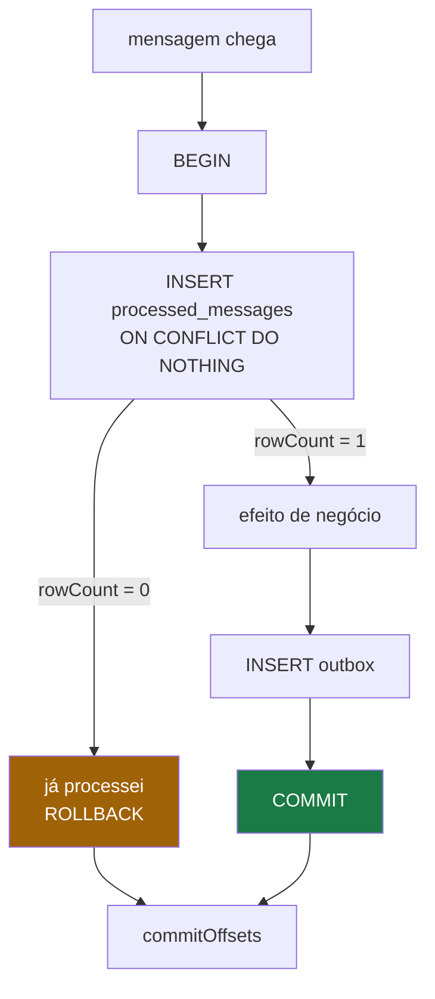

# 06 — Idempotência

## O problema

O módulo [04](04-entrega-e-commit-de-offset.md) mostrou que a ordem correta duplica. O
[05](05-outbox.md) mostrou que o relay também republica. Num serviço de pagamento, uma
duplicata é uma **cobrança em dobro**.

Somando as fontes, a entrega é at-least-once por três motivos independentes:

1. o relay do outbox pode republicar depois de um crash;
2. o consumidor pode persistir e morrer antes de commitar o offset;
3. um rebalance pode reentregar o batch a outro membro do grupo.

E `enable.idempotence=true` no produtor **não** resolve isso. Ele deduplica no broker por
`(producerId, sequence)` dentro de uma sessão — não sobrevive a reinício do relay nem a
replay.

## O mecanismo

Uma tabela de inbox, com chave primária **composta**, escrita na mesma transação do efeito:

```sql
CREATE TABLE processed_messages (
  event_id       uuid NOT NULL,
  consumer_group text NOT NULL,
  processado_em  timestamptz NOT NULL DEFAULT now(),
  PRIMARY KEY (event_id, consumer_group)
);
```



## Por que a chave é composta

`order.created` é consumido pelo `payment-service` **e** pelo `notification-service`. Os
dois **precisam** processar. Com PK só em `event_id`, o primeiro grupo a chegar barra o
outro — e o cliente simplesmente nunca recebe o e-mail, sem erro em log nenhum.

## Por que `ON CONFLICT DO NOTHING`, e não `try/catch`

No Postgres, uma violação de constraint **aborta a transação**. Depois dela, todo comando
na mesma transação falha com `current transaction is aborted`. Capturar a exceção e seguir
não funciona — daria para salvar com `SAVEPOINT`, mas `ON CONFLICT` é direto e mais rápido.

Esse detalhe é fácil de errar e o sintoma confunde: o handler parece "às vezes não
funcionar" quando na verdade toda duplicata destrói a transação inteira.

## Rode

```bash
pnpm ex 04
```

Quatro partes: a mesma mensagem 5× em sequência; 5× em **paralelo** (a corrida real de um
rebalance); dois grupos distintos com a PK correta; e a versão errada, com o bug silencioso.

## Os três detalhes que decidem se funciona

**1. A chave é `(event_id, consumer_group)`.** Só `event_id` barra grupos inocentes.

**2. O `INSERT` vive na mesma transação do efeito.** Fora dela, um crash entre os dois
marca como processado algo que não foi — e você voltou à perda do módulo 04. Cache/Redis
com TTL é mais rápido e não é atômico com a transação: reabre exatamente o buraco que o
padrão fecha.

**3. Retenção maior que a do tópico.** A tabela cresce para sempre e precisa de limpeza.
Mas se o tópico guarda 7 dias e o inbox 3, um replay reprocessa tudo o que o inbox já
esqueceu. O módulo [09](09-replay-e-evolucao.md) mostra o saldo dobrando por causa disso.

## O limite

Isto só cobre o que está **dentro** da transação. Chamada ao gateway de pagamento e envio
de e-mail ficam de fora — e precisam da própria chave de idempotência no lado remoto
(quase todo gateway sério aceita um header `Idempotency-Key`).

Na borda HTTP vale o mesmo: `POST /orders` com `Idempotency-Key`, guardando
`(chave, customerId) → resposta` por 24h. Sem isso, um duplo-clique do cliente vira dois
pedidos e duas cobranças, antes de qualquer mensagem existir.

## No código

- Handler idempotente comentado: [`examples/src/04-idempotencia.ts`](../../examples/src/04-idempotencia.ts) — função `handler()`
- No sistema real: `packages/idempotency` (Fase 2 do [plano](../PLAN.md))

## O que quebra se você errar

Confiar em handlers "naturalmente idempotentes" (`UPDATE ... SET status='PAID'`). Funciona
para alguns casos e não para `INSERT` de estorno — cobertura parcial, falsa segurança
total.

## Leia também

- [ADR-0007 — Idempotência por inbox](../adr/0007-idempotencia-por-inbox.md)
- Próximo: [07 — Retry e DLT](07-retry-e-dlt.md)
