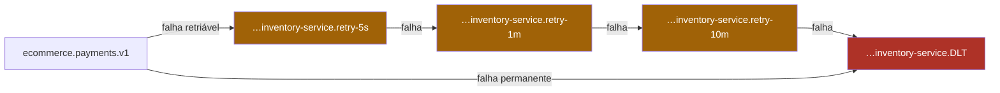

# 07 — Retry e DLT

## O problema

Kafka não tem DLQ nem retry nativo — ao contrário do RabbitMQ, que tem DLX e TTL de
fábrica. Um handler que lança exceção tem duas saídas, e as duas são ruins:

- **não commitar o offset**: o consumidor relê a mesma mensagem para sempre. A partição
  para. Junto com ela, todos os outros pedidos que caíram nela.
- **commitar**: a mensagem é perdida (módulo [04](04-entrega-e-commit-de-offset.md)).

E retryar na própria partição com backoff também trava: enquanto uma mensagem espera,
**todas** as outras daquela partição esperam com ela. É o _head-of-line blocking_.

## O mecanismo

Três coisas juntas, e a primeira é a mais esquecida.

**1. Classificar o erro antes de retryar.**

| Retriável → escada  | Permanente → DLT direto     |
| ------------------- | --------------------------- |
| timeout de rede     | schema inválido             |
| `503` do gateway    | `eventVersion` desconhecida |
| deadlock de banco   | regra de negócio violada    |
| broker indisponível | agregado inexistente        |

Schema inválido não melhora em 10 minutos. Sem classificação, ele gasta a escada inteira
e chega na DLT igual — só 11 minutos depois.

**2. Escada em tópicos dedicados**, por `(tópico de origem, consumer group)`:



Escada por consumer group importa: o retry do Inventory não interfere no do Payment sobre
o mesmo tópico de origem.

**3. Commitar o offset do tópico PRINCIPAL ao desviar.** É esse commit — e não o retry em
si — que devolve a partição ao fluxo. Esquecê-lo significa ter construído a escada e
mantido o travamento que ela existia para resolver.

## Rode

```bash
pnpm ex 05
```

Três mensagens com destinos diferentes, tópicos e atrasos reais:

```
 msg │ tópico      │ tentativa │ desfecho
─────┼─────────────┼───────────┼───────────────
  A  │ (principal) │ 0         │ → retry-500ms
  B  │ (principal) │ 0         │ DLT
  C  │ (principal) │ 0         │ → retry-500ms
  A  │ retry-500ms │ 1         │ → retry-1s
  C  │ retry-500ms │ 1         │ → retry-1s
  A  │ retry-1s    │ 2         │ sucesso
  C  │ retry-1s    │ 2         │ → retry-2s
  C  │ retry-2s    │ 3         │ DLT
```

B gastou **uma** tentativa; C gastou quatro; as duas terminaram no mesmo lugar. A
diferença inteira foi a classificação do erro.

## O preço, e ele é sério

**Desviada para o retry, a mensagem pode ser processada DEPOIS da seguinte do mesmo
pedido.** A ordenação daquele agregado morre ali — exatamente a garantia que o módulo
[03](03-particoes-chave-e-ordenacao.md) construiu com tanto cuidado.

A defesa é a máquina de estados idempotente e monotônica: `applyEvent` rejeita transição
inválida com WARN em vez de corromper o agregado.

Onde ordem estrita valer mais que throughput, a escolha certa é o **oposto**: aceitar o
head-of-line blocking e retryar in-place. Não existe resposta universal; existe escolha
consciente, e ela pertence ao ADR.

**Explosão de tópicos.** 13 assinaturas × (3 retries + 1 DLT) = 52 tópicos além dos 4 de
negócio. Por isso eles são derivados de código, nunca escritos à mão:

```ts
// packages/contracts/src/topics.ts
export function allTopics(): string[] {
  /* deriva de SUBSCRIPTIONS */
}
```

## Headers da DLT

```
x-original-topic     ecommerce.payments.v1
x-retry-count        3
x-first-failure-at   2026-08-26T12:00:03.140Z
x-last-error         ETIMEDOUT ao chamar o serviço de saldo
x-stacktrace-hash    sha256:eabbaa1c
x-consumer-group     inventory-service
```

O stacktrace vai como **hash**, nunca inteiro: stacktrace carrega payload, e payload
carrega PII. A DLT também tem retenção curta pelo mesmo motivo.

## O que quebra se você errar

DLT sem ferramenta de reprocessamento. Ninguém abre um tópico com 4 mil mensagens na mão,
então ela vira cemitério: as mensagens estão lá, ninguém olha, e o alerta de "DLT > 0"
acaba silenciado por fadiga. É por isso que a `tools/dlq-inspector` está no plano — ela
não é enfeite.

## Leia também

- [ADR-0008 — Retry escalonado e DLT](../adr/0008-retry-escalonado-e-dlt.md)
- [ADR-0003 — Kafka como broker](../adr/0003-kafka-como-broker.md) (o trade-off contra RabbitMQ)
- Próximo: [08 — Compensação](08-compensacao.md)
