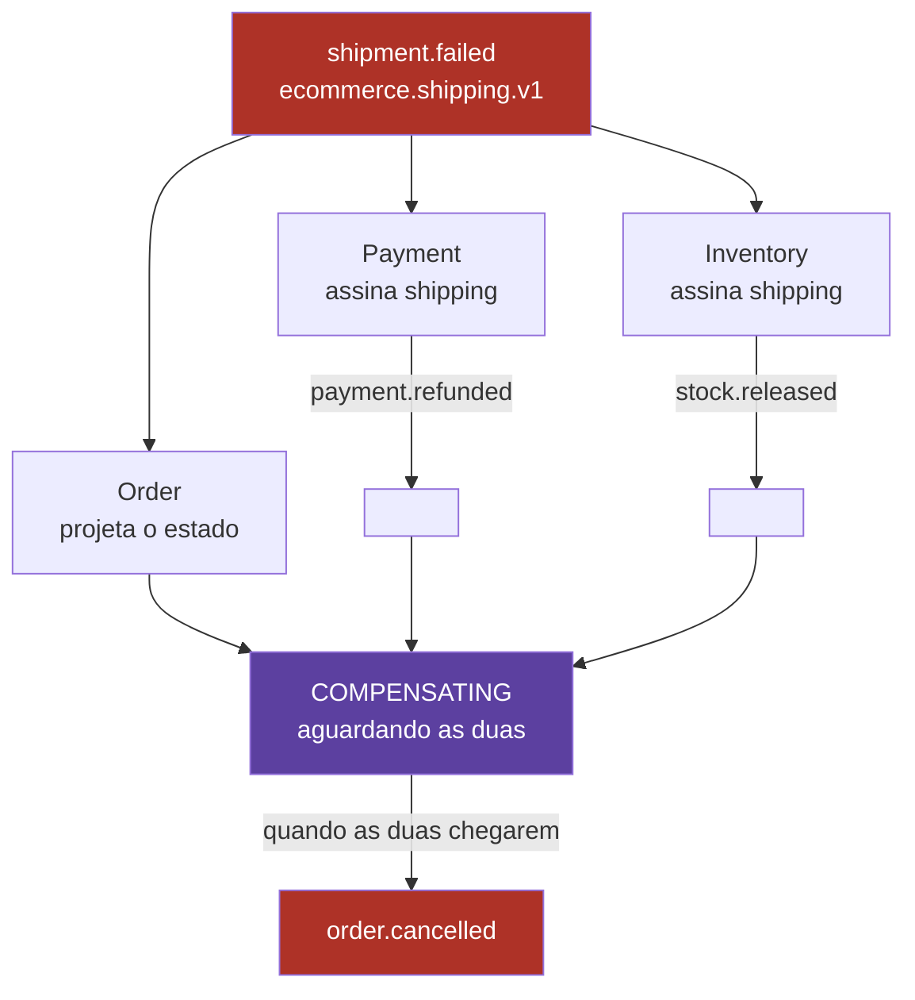

# 08 — Compensação

## O problema

O envio falhou. Mas o pagamento já foi autorizado e o estoque já foi reservado — as duas
transações commitaram nos seus bancos, e não há `ROLLBACK` que as alcance. Alguém precisa
executar as ações que as desfazem.

## O mecanismo

Cada passo da saga tem uma ação compensatória. Em coreografia, **ninguém manda desfazer**:
o serviço que executou o passo assina o tópico onde a falha posterior aparece e compensa
por conta própria.



## A matriz

| Falha               | Quem compensa           | Ação                     | Evento emitido                       |
| ------------------- | ----------------------- | ------------------------ | ------------------------------------ |
| `payment.failed`    | ninguém                 | nada foi efetivado ainda | `order.cancelled`                    |
| `stock.unavailable` | Payment                 | estorna a autorização    | `payment.refunded`                   |
| `shipment.failed`   | Inventory **e** Payment | libera reserva / estorna | `stock.released`, `payment.refunded` |
| `saga.timeout`      | Inventory e Payment     | ambos                    | idem                                 |

Ela existe como **dado**, não como comentário:

```ts
// packages/contracts/src/registry.ts
export const COMPENSATION_MATRIX = [ ... ];
```

Serve para documentação, teste e para o sweeper de timeout saber o que esperar. E **não**
é um orquestrador: nenhum serviço a consulta para decidir o próximo passo.

## Compensação dupla e paralela

O caso mais interessante é `shipment.failed`: dois serviços compensam ao mesmo tempo, e
nenhum deles é o Shipping. O Order Service só fecha em `CANCELLED` quando as duas
compensações chegarem — o que exige que ele saiba **quais** esperar por estado.

Mais conhecimento global vazando para um serviço que teoricamente só reage.

## Veja

Abra o [simulador](../simulator/saga-console.html) e rode **Falha no envio**. A aba
_Pedido_ mostra `COMPENSATING` com `faltam PAYMENT_REFUNDED + STOCK_RELEASED`, e as duas
riscando conforme chegam.

## Compensação não é rollback

Três diferenças que o desenho tem que assumir:

**1. Ela é visível.** Estornar um pagamento deixa duas linhas no extrato do cliente: a
cobrança e o estorno. Não há como fingir que a cobrança não aconteceu.

**2. Ela pode falhar.** O estorno é uma chamada ao gateway, que pode dar timeout. Uma
compensação que falha entra na própria escada de retry — e se esgotar, vai para a DLT com
um pedido preso em `COMPENSATING`. Esse é o estado mais desagradável do sistema, e é
exatamente o que a `dlq-inspector` precisa resolver.

**3. Ela precisa ser idempotente.** `payment.refunded` pode ser reentregue. Estornar duas
vezes é devolver dinheiro em dobro:

```ts
if (!S.payment || !S.payment.authorized || S.payment.refunded) return { invalid: true };
S.payment.refunded = true;
```

## A ordem importa?

Na compensação dupla, não: liberar estoque e estornar pagamento são independentes. Mas em
sagas com passos que dependem um do outro, compensação corre em **ordem inversa** à
execução — e em coreografia você não controla essa ordem, porque não há coordenador.
Se a ordem inversa for obrigatória no seu domínio, é um argumento direto por orquestração.

## O que quebra se você errar

Compensar sem verificar se o passo foi realmente executado. `shipment.failed` chega,
Payment estorna — mas o pagamento nunca foi autorizado, porque a falha veio de um pedido
que nunca passou por lá. Sem a guarda `!S.payment.authorized`, você acabou de emitir um
estorno de uma cobrança inexistente.

## Leia também

- [ADR-0002 — SAGA coreografada](../adr/0002-saga-coreografada.md)
- Próximo: [09 — Replay e evolução de schema](09-replay-e-evolucao.md)
