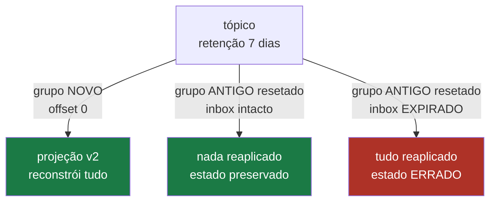

# 09 — Replay e evolução de schema

## O problema

A projeção do Order Service tem um bug: há três meses ela conta pedidos cancelados como
confirmados. O dado está errado no banco de leitura — mas os eventos estão todos lá, no
log.

E o outro lado do mesmo problema: você precisa adicionar um campo em `payment.approved`.
Como fazer isso sem quebrar quatro consumidores que já leem a v1?

## O mecanismo: replay

Kafka é um **log retido**, não uma fila consumida. Reprocessar do offset zero é operação
de rotina, e a idempotência é o que torna isso seguro — sob uma condição escondida.



**A forma certa de corrigir uma projeção não é resetar o grupo existente** — é criar um
grupo **novo**, que naturalmente não tem registro de idempotência nenhum e por isso aplica
tudo de propósito. As duas projeções coexistem: a antiga serve o tráfego enquanto a nova é
conferida. Depois você troca a leitura e apaga a antiga. Zero migration, zero downtime.

## A condição escondida

```
retenção de processed_messages  >  retenção do tópico
```

Se o tópico guarda 7 dias e o job de limpeza do inbox apaga aos 3, existe uma janela de 4
dias de mensagens que **estão no log** e cujo registro de idempotência **já foi apagado**.
Qualquer replay nessa janela aplica tudo de novo.

## Rode

```bash
pnpm ex 06
```

Quatro rodadas. A quarta é a armadilha:

```
 grupo   │ saldo │ esperado │ eventos aplicados
─────────┼───────┼──────────┼───────────────────
 proj-v1 │ 20    │ 10       │ 8
```

O saldo dobrou. Nenhum erro em log — só um número errado, dias depois, sem ninguém ligar
ao job de limpeza.

## Evolução de schema

O envelope trava `eventType` e `eventVersion` em literais por definição:

```ts
// packages/contracts/src/envelope.ts
const envelope = envelopeBaseSchema.extend({
  eventType: z.literal(config.type),
  eventVersion: z.literal(config.version),
  payload: config.payload,
});
```

E o registro indexa por `"tipo@versão"`, não só por tipo:

```ts
// packages/contracts/src/registry.ts
const BY_TYPE_AND_VERSION = new Map(DEFINITIONS.map((d) => [`${d.type}@${d.version}`, d]));
```

Consequência: `payment.approved@2` é um evento **diferente** de `payment.approved@1`. Um
consumidor que só conhece a v1 **rejeita** a v2 explicitamente (`UnprocessableEventError`,
permanente → DLT direto) em vez de interpretá-la com o parser errado.

Isso é OWASP A08 (_Software and Data Integrity Failures_) aplicado a mensageria: nunca
desserializar em tipo arbitrário, nunca "adivinhar" formato.

### As regras de compatibilidade

| Mudança                          | Compatível?                                | Como fazer                                    |
| -------------------------------- | ------------------------------------------ | --------------------------------------------- |
| adicionar campo opcional         | sim                                        | mesma versão                                  |
| adicionar campo obrigatório      | **não**                                    | nova versão, ou opcional com default          |
| remover campo                    | **não**                                    | deprecate primeiro, remova numa versão futura |
| renomear campo                   | **não**                                    | é remover + adicionar                         |
| estreitar tipo (`string` → enum) | **não**                                    | nova versão                                   |
| alargar tipo (enum → `string`)   | sim para consumidores, não para produtores | cuidado                                       |

A rede de proteção é o teste de snapshot do catálogo:

```
packages/contracts/test/catalog.spec.ts
```

Renomear um evento, mudar o tópico de destino ou publicar uma v2 sem atualizar o snapshot
**quebra o build**. É o único jeito de impedir que um serviço mude um contrato que outros
quatro consomem sem que ninguém perceba na revisão.

### O procedimento de duas fases

Para uma mudança incompatível, nunca troque de uma vez:

1. **Produza as duas versões** por um período. Consumidores novos leem a v2, antigos
   continuam na v1.
2. Quando todos os consumidores estiverem na v2, **pare de produzir a v1** e espere a
   retenção do tópico expirar.
3. Só então remova a definição da v1 do `contracts`.

Remover a v1 antes de a retenção expirar significa que um replay encontra eventos v1 que
o código já não sabe ler — todos para a DLT.

## O que quebra se você errar

Resetar offsets de um grupo em produção para "reprocessar umas mensagens". Se o inbox
estiver íntegro, nada acontece (bom). Se o job de limpeza tiver passado, você acabou de
reaplicar meses de eventos. A rodada 4 do exemplo 06 é literalmente isso.

## Leia também

- [ADR-0010 — Contratos JSON com Zod](../adr/0010-contratos-json-com-zod.md)
- [ADR-0007 — Idempotência por inbox](../adr/0007-idempotencia-por-inbox.md)
- Próximo: [10 — Do Docker ao Kubernetes](10-do-docker-ao-kubernetes.md)
